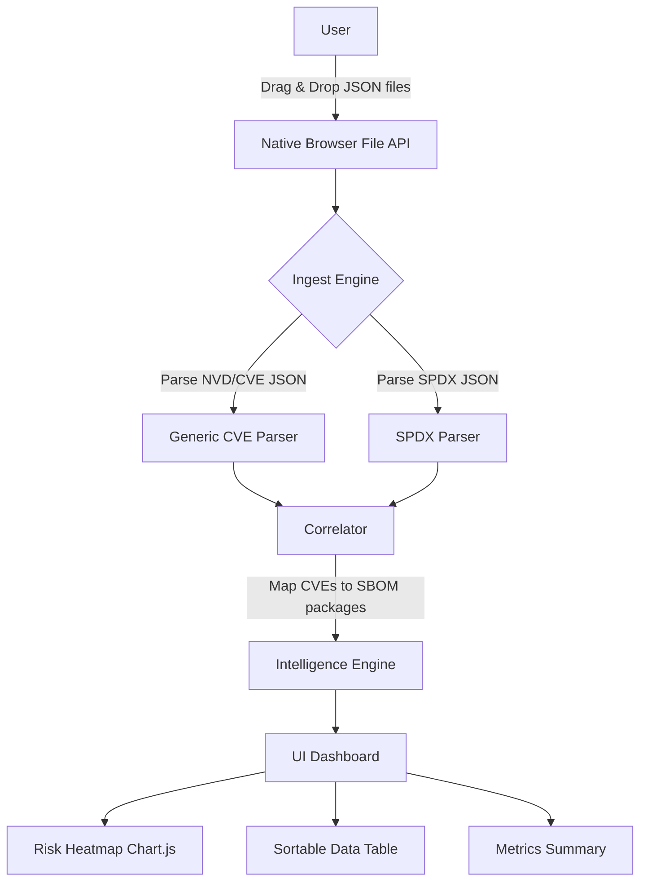

# System Architecture

VulnCanvas is built on a modern, lightweight static site architecture to ensure high performance and maximum security (zero-trust). 

## Design Philosophy

The core philosophy revolves around client-side execution. By utilizing standard ES Modules (Vanilla JS) and Tailwind CSS, the application operates entirely within the user's browser context without the need for a backend processing server.

## Data Flow

## Correlation Logic

When an optional Yocto SPDX JSON file is provided:
1. The **SPDX Parser** extracts all included packages, focusing on `name` and `versionInfo`.
2. The **CVE Parser** identifies affected Common Platform Enumeration (CPE) configurations within the vulnerabilities.
3. The **Correlator** compares the product names and versions from the CPEs against the SPDX bill of materials.
4. Vulnerabilities matching exact components present in your SBOM are flagged, allowing you to filter out irrelevant CVEs that do not impact your specific build.
